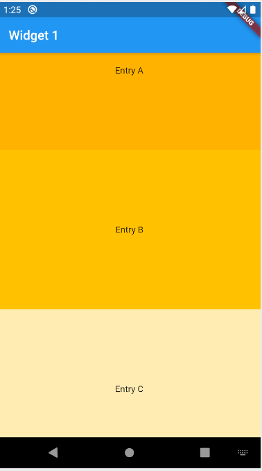
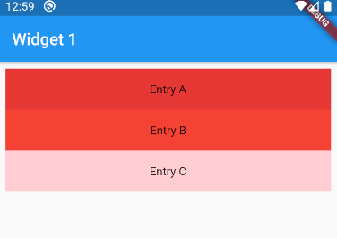

# Listview Vs Column + SingleChildScrollView

A lot of flutter programmer while deciding the above topic will get confused, as they perform most of the things similar. So we would suggest you to go through video and blogs which links are given below. 

# Medium Blog:
- [Listview Vs Column + SingleChildScrollView](https://medium.com/flutterworld/flutter-problem-listview-vs-column-singlechildscrollview-43fdde0fa355)

 
 

# Youtube Tutorial:

