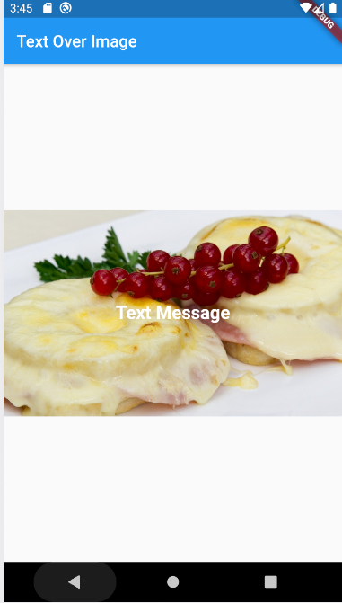

# Text Over Image

This is very often used in every application where we have to draw text over an image.
To tackle this thing Flutter have Stack Widget, It used to arrange widgets on top of a base widget ften an image. The widgets can completely or partially overlap the base widget.

# Medium Blog:
- [Text Over Image](https://medium.com/flutterworld/flutter-text-over-image-bb045a129bae)

 

# Youtube Tutorial:

